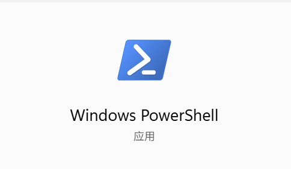
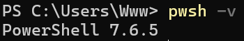
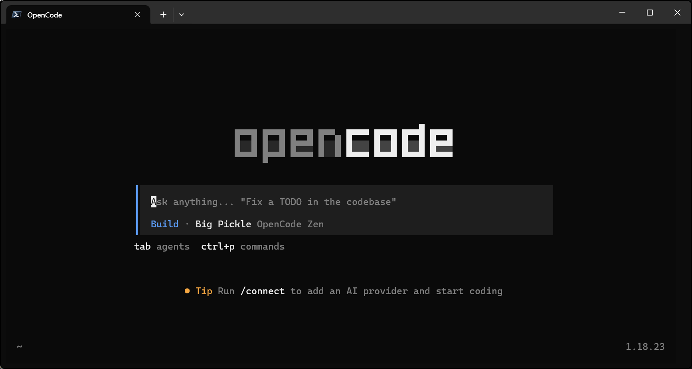
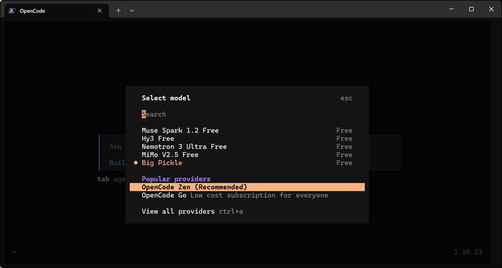
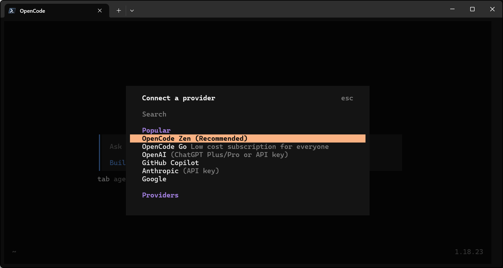
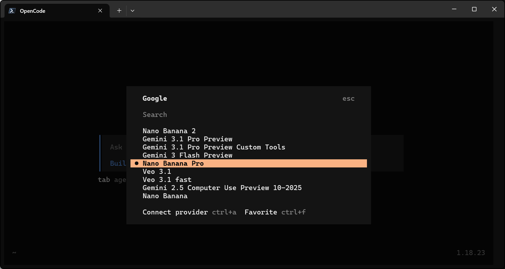
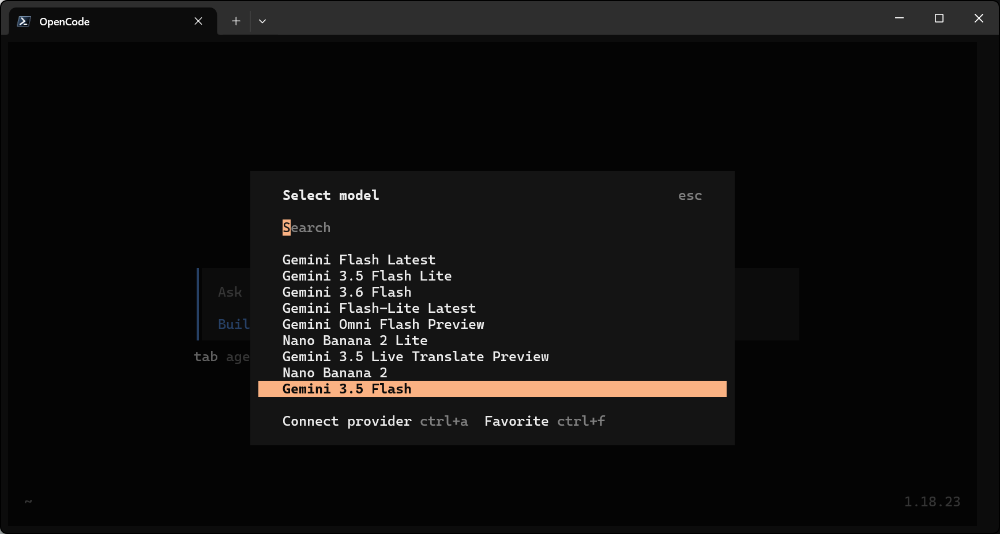
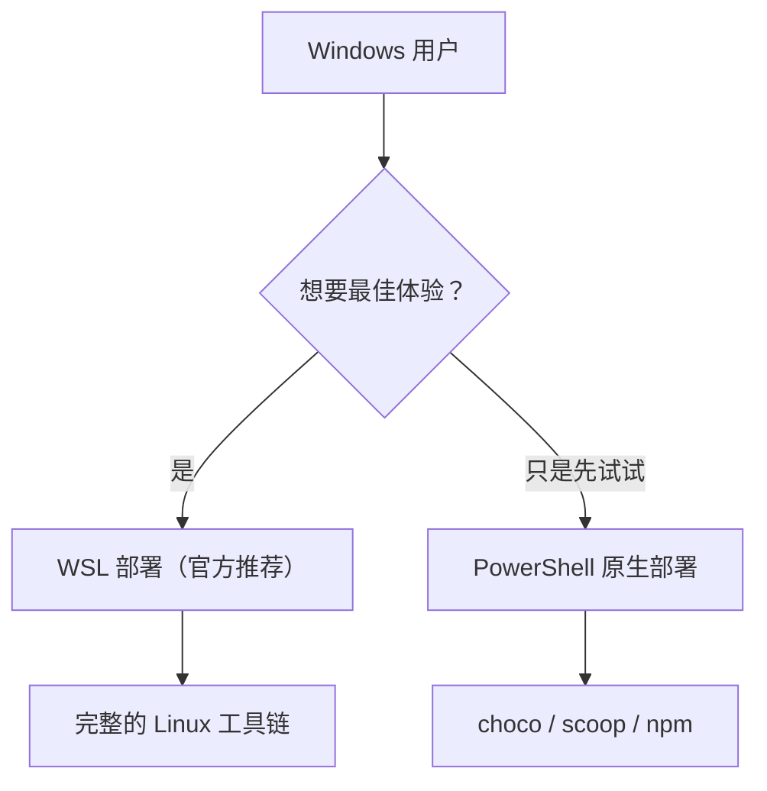

[opencode](https://opencode.ai) 是一款开源的 AI 编程代理（AI coding agent），它提供终端界面、桌面应用和 IDE 扩展等多种使用方式。它可以读取你的项目代码、回答架构问题、编写新功能，并且**所有改动都可以随时撤销**。

- 官网：<https://opencode.ai>
- 官方文档：<https://opencode.ai/docs>

这篇教程会带你在Windows电脑上从零部署 opencode，中间穿插它最常用的几个命令，最后重点解释两件事：
- **原生部署和 WSL 部署有什么区别**
- **怎么让 WSL 里的 opencode 和 VS Code 无缝协作**

## 准备工作

开始之前只需要准备三样东西：

1. **一台电脑**：Windows，mac，Linux。本文主要针对Windows
2. **一个能用的终端**：
	- Windows：用 PowerShell 就行。不过 opencode 是 TUI（终端界面）程序，建议从开始菜单打开「**Windows Terminal**（终端）」来运行它，渲染效果和字体表现都会更好
	- macOS / Linux：系统自带的终端就够了 
3. ~~一个大模型的 API Key（或对应订阅）~~：opencode 自带免费模型接入，若想有更优越的体验需要接入一家 LLM 提供商，OpenAI、Anthropic、DeepSeek 等

## 安装 opencode

### 使用官方脚本安装（推荐）

macOS、Linux 以及后面要讲的 WSL 环境，都可以一行搞定：

```bash
curl -fsSL https://opencode.ai/install | bash
```

> [!TIP] 建议
> 这个脚本可以重复执行，opencode 有新版本时重新跑一遍即可原地升级。

> [!CAUTION] 注意
>Windows**不建议**在powershell中直接执行该命令，可能存在不兼容等未知的bug。

### Windows安装方式



自带版本存在一些显示及语法bug**建议**使用新版powershell 7+获得更佳体验，下面部分为新版获取教程，若不想获取请跳转至node.js小节。

```bash
winget upgrade --id Microsoft.PowerShell
# WinGet 是 Windows 客户端安装 PowerShell 7 的推荐方式
```
加载完成后重新打开一个 PowerShell 7 窗口，检查：

```bash
pwsh -v
```



目前 WinGet 提供的是最新稳定版 PowerShell 7；PowerShell 7 和系统自带的 Windows PowerShell 5.1 是并存的，不会把 5.1 替换掉。

#### 推荐node.js包管理器：

在powershell中执行

```bash
# 安装 Node.js LTS
winget install OpenJS.NodeJS.LTS

# 如果 winget 不存在，请到 Node.js 官网 https://nodejs.org 下载安装包。

# 安装完成后重新打开 PowerShell，检查：
node -v
npm -v

# 安装 OpenCode
npm install -g opencode-ai

# 验证 OpenCode
opencode --version
```

若能够正确输出版本号，那么OpenCode就已成功安装，在 PowerShell 执行：

```bash
opencode
```
即可进入OpenCode界面



#### 其他包管理器

macOS / Linux 用户还可以用 Homebrew（官方维护的 tap，比 Homebrew 仓库里的公式更新更及时）：

```bash
brew install anomalyco/tap/opencode
```

Arch Linux 用户：

```bash
sudo pacman -S opencode    # 官方仓库（稳定版）
paru -S opencode-bin       # AUR（最新版）
```

安装完成后验证一下版本号：

```bash
opencode --version
```

想看源码或下载各平台的二进制文件，可以直接前往它的 GitHub 仓库：

::github{repo="anomalyco/opencode"}

## 配置模型提供方

~~装好之后第一件事是让它「有脑子」——接入至少一家模型提供商。这一步全程在交互界面里完成~~：

opencode 自带免费模型接入



> [!NOTE] 提示
> 到这一步就可以进行入门探索了！

下面是接入其他模型步骤

1. 在输入框里敲 `/connect` 并回车，会出现提供商选择列表；



2. 选择你拥有的API供应商；

3. 按提示粘贴 API Key 回车，看到确认信息即接入成功。其他提供商（OpenAI、Anthropic、DeepSeek）流程完全一样：`/connect` → 选择 → 粘贴 Key；



4. 初次选择的是默认模型，输入 `/models`，在列表里可以切换你想要的模型。以后随时可以用这个命令切换。


> [!IMPORTANT] 重要
> 所有凭证都明文保存在本地的 `~/.local/share/opencode/auth.json` 中，不要把这个文件提交到 Git 仓库，也不要在分享屏幕 / 截图时露出内容。

## 初始化项目

接下来进入你的项目文件夹中：

```bash
cd /path/to/project
opencode
```

第一次在一个项目里使用时，建议先执行：

```text
/init
```

opencode 会自动分析项目的目录结构、技术栈和编码习惯，然后在项目根目录生成一份 `AGENTS.md`。

> [!TIP] 建议
> 把生成出来的 `AGENTS.md` 提交进 Git。它能帮助 opencode（以及很多同样支持该规范的 AI 工具）持续理解这个项目的结构与约定，越用越顺手。

## 基本使用速览

部署大功告成，这里介绍一下最高频的操作流程，更多用法可以自己摸索或查[官方文档](https://opencode.ai/docs)。

一个典型的「先规划再动手」工作流是这样的：

1. 按 <kbd>Tab</kbd> 键切到 **Plan（规划）模式**，此时 opencode 只会分析和给出实施方案，不会动你的代码；
2. 描述需求，比如：

	```text
	当用户删除笔记时，在数据库里打上"已删除"标记，
	再做一个页面展示最近删除的笔记，并支持恢复和彻底删除。
	```

3. 对方案不满意就直接补充反馈继续聊（还可以把设计稿图片直接拖进终端给它参考）；
4. 满意后再按一次 <kbd>Tab</kbd> 切回 **Build（构建）模式**，说一句「就这样改吧」，它才会真正动手。

对于简单改动也可以不开规划模式，直接一句话描述清楚即可。中途发现改得不对就用 `/undo` 回滚，多次回滚也允许，对应地还有 `/redo`。

常用按键与命令一览：

| 输入 | 作用 |
| ---- | ---- |
| <kbd>Tab</kbd> | 在 Plan / Build 模式间切换 |
| `@文件名` | 模糊搜索并把指定文件加入上下文 |
| `/init` | 分析项目并生成 `AGENTS.md` |
| `/models` | 查看与切换模型 |
| `/undo`、`/redo` | 撤销 / 重做上一轮改动 |
| `/share` | 生成当前会话的分享链接（默认不会公开会话） |

## Windows 原生与 WSL 部署的区别

Windows 用户实际上面临两条路线：**直接装在 Windows 上**，或者**装进 WSL（适用于 Linux 的 Windows 子系统）里**。两条路都通，但体验有明显差别。



### 方式一：Windows 原生安装

在 PowerShell 里任选一种包管理器即可，前文已介绍npm包管理器方式

```powershell
choco install opencode        # Chocolatey
scoop install opencode        # Scoop
npm install -g opencode-ai    # npm
mise use -g github:anomalyco/opencode     # mise
docker run -it --rm ghcr.io/anomalyco/opencode    # Docker
```

不想用包管理器的话，也可以去 [Releases 页面](https://github.com/anomalyco/opencode/releases) 直接下载可执行文件。

> [!NOTE] 提示
> 目前 Windows 上暂不支持通过 Bun 安装，支持正在推进中。

### 方式二：在 WSL 中安装

WSL 是微软提供的「Windows 里的 Linux」，安装过程对新手也很友好：

1. 以管理员身份打开 PowerShell，执行：

	```powershell
	wsl --install
	```

	然后重启电脑，首次进入 Ubuntu 时按提示设置用户名和密码；

2. 从开始菜单打开 Ubuntu（或在 Windows Terminal 的下拉箭头里选择 Ubuntu 发行版），顺手更新一下基础组件：

	```bash
	sudo apt update && sudo apt upgrade -y
	```

3. 用第一节讲过的官方脚本安装 opencode（如果提示缺少 curl，先 `sudo apt install -y curl`）：

	```bash
	curl -fsSL https://opencode.ai/install | bash
	```

4. 之后就可以正常使用了。如果你的项目还放在 Windows 分区上，可以通过 `/mnt/c` 这类挂载路径访问（C 盘是 `/mnt/c`，D 盘是 `/mnt/d`，以此类推）：

	```bash
	cd /mnt/c/Users/你的用户名/project
	opencode
	```

> [!TIP] 建议
> `/mnt/c` 下的磁盘 I/O 经过一层转换，性能损耗不小。建议把常用仓库 clone 到 WSL 自己的文件系统里（比如 `~/code/` 目录下）再打开，流畅度和出错率都会好不少。

### 两种方式怎么选

先把官方的态度放在前面：

> [!IMPORTANT] 重要
> opencode 官方明确表示：虽然它可以直接跑在 Windows 上，但为了获得最佳体验，推荐使用 WSL。理由是 WSL 能带来更好的文件系统性能、完整的终端支持，以及与 opencode 所依赖的开发工具链更好的兼容性。

具体差异整理成一张表：

| 对比项 | Windows 原生 | WSL 部署 |
| ------ | ------------ | -------- |
| 文件系统性能 | 可用，大仓库扫描偏慢 | Linux 原生 ext4，明显更快 |
| 终端环境 | PowerShell / CMD，缺一些 Unix 工具 | 完整的 Linux Shell 与工具链 |
| 功能完整性 | 个别生态仍在适配（如 Bun 支持） | 全功能，无平台差异 |
| 访问 Windows 文件 | 直接访问 | 通过 `/mnt/c/`、`/mnt/d/` 挂载访问 |
| 安装渠道 | choco / scoop / npm / mise / Docker | 官方脚本 / npm / Homebrew / 发行版包管理器 |
| 数据隔离 | 独立的一套配置与会话 | 另一套独立的配置与会话，两边互不相通 |

只是轻度尝鲜，可以先装原生版，之后再补一个 WSL 也完全不冲突。

## 进阶：配合 VS Code 使用

和 VS Code 搭配起来之后，「编辑器看代码 + 终端跑 opencode」可以同屏进行。

## 常见问题

**1. 忘了自己配置过哪些提供商的凭证？**

```bash
opencode auth list
```

列出当前已保存的所有 API 凭证。

**2. 安装完提示找不到 `opencode` 命令？**

关掉终端重新打开，让 PATH 生效；如果还不行，翻一下安装脚本的输出，里面会提示需要手动添加的 PATH 条目。

**3. 在 WSL 里操作 `/mnt/c` 下的项目特别慢，或者行为异常？**

回到上文「方式二」的建议：把仓库挪进 WSL 自身的文件系统（如 `~/code/`）。另外注意 WSL 和 Windows 原生是两套完全独立的环境——凭证、会话、配置都不共享，如果在两边都装了 opencode，记得在 WSL 里重新执行一次 `/connect`。

## 参考资料

- [opencode 官网](https://opencode.ai)
- [opencode 官方文档：Getting Started](https://opencode.ai/docs/)
- [opencode 官方文档：Windows (WSL)](https://opencode.ai/docs/windows-wsl)