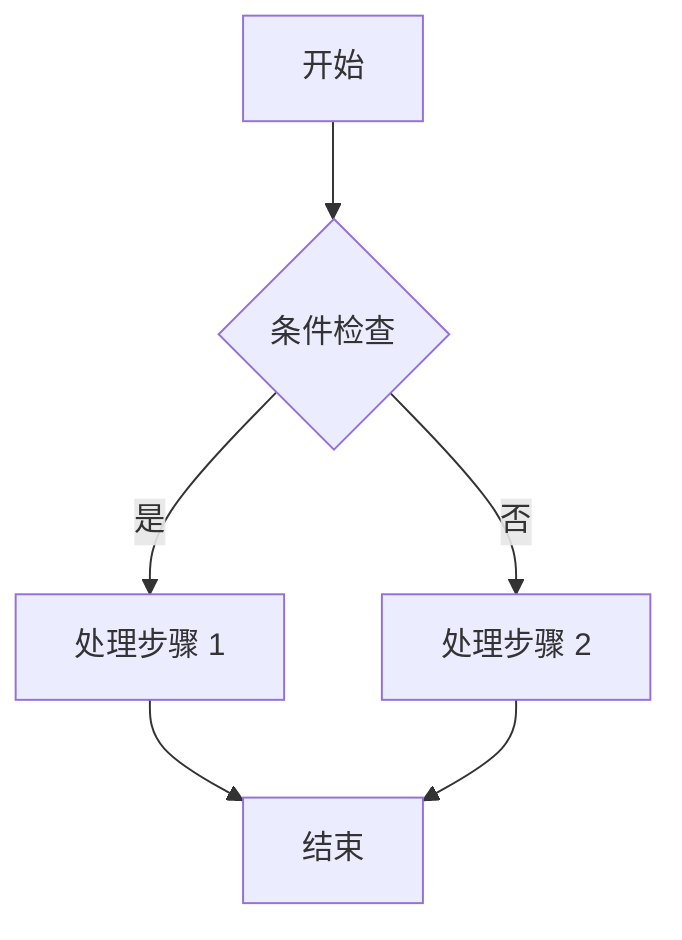
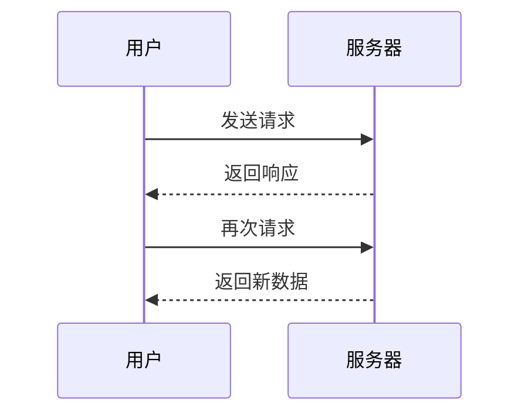

> [!IMPORTANT] AI 生成声明
> 本文为 AI 自动生成的测试文章，由大语言模型 **ox-alpha**（一家未公开组织开发的模型）通过 opencode 命令行工具撰写，仅用于验证主题的 Markdown 渲染效果。

这是一篇**格式测试**文章，用于集中验证主题对常用与扩展语法的支持情况。如果你能正常看到本页所有元素，说明渲染管线工作正常。

## 文本样式

普通文本，以及 **粗体**、*斜体*、***粗斜体***、~~删除线~~、`行内代码`。

还可以使用 HTML 标签：<mark>高亮标记</mark>、<kbd>Ctrl</kbd> + <kbd>C</kbd> 快捷键、H<sub>2</sub>O 与 x<sup>2</sup>。

剧透文本（点击显示）：本文的秘密 :spoiler[其实什么都没有 **真的**]！

邮箱会被自动保护以防爬虫抓取：contact@example.com

链接：[Firefly 主题文档](https://docs-firefly.cuteleaf.cn)、[站内文章]([[hello]])、自动链接 https://astro.build

脚注测试：Firefly 是一个 Astro 博客主题[^1]。

[^1]: 项目地址：https://github.com/CuteLeaf/Firefly

## 列表

### 无序列表

- 第一项
- 第二项
	- 嵌套项 2.1
	- 嵌套项 2.2
- 第三项

### 有序列表

1. 准备环境
2. 安装依赖
	1. pnpm install
	2. pnpm dev
3. 开始写作

### 任务列表

- [x] 支持 GitHub 风格任务列表
- [x] 支持表格与删除线（GFM）
- [ ] 待办事项示例

## 引用与提醒框

> 这是一段引用文字。
> 引用可以有多行，也可以包含 **其他样式**。

当前站点提醒框主题为 GitHub 风格：

> [!NOTE] 提示
> 突出显示用户应该注意的信息。

> [!TIP] 建议
> 可选信息，帮助用户更成功。

> [!IMPORTANT] 重要
> 用户必须了解的关键信息。

> [!WARNING] 警告
> 需要立即注意的关键内容。

> [!CAUTION] 注意
> 行动的负面潜在后果。

## 代码块

普通 JavaScript 代码块：

```ts
interface Post {
	title: string;
	published: Date;
	tags: string[];
}

function getLatest(posts: Post[]): Post | undefined {
	return [...posts].sort((a, b) => b.published.getTime() - a.published.getTime())[0];
}
```

带标题与行号、并高亮指定行（第 3-4 行）：

```ts title="config.ts" {3-4}
export const siteConfig = {
	title: "渔屋",
	site_url: "https://yuihoyo.top",
	lang: "zh_CN",
};
```

Diff 差异对比：

```diff
+ 新增的一行
- 删除的一行
  保持不变的一行
```

Shell 命令：

```bash
pnpm new-post "我的新文章"
pnpm build
```

超过阈值行数的代码块会自动折叠（可点击展开）：

```python title="long_demo.py"
def fibonacci(n):
    a, b = 0, 1
    for _ in range(n):
        yield a
        a, b = b, a + b

def main():
    fib = list(fibonacci(30))
    print("前 30 项斐波那契数列:")
    print(fib)
    print(f"总和: {sum(fib)}")

    squares = [x * x for x in range(1, 21)]
    print("1-20 的平方数:")
    print(squares)

    primes = []
    for num in range(2, 100):
        if all(num % p != 0 for p in primes):
            primes.append(num)
    print("100 以内的素数:")
    print(primes)

if __name__ == "__main__":
    main()
```

## 表格

| 语法       | 用途         | 状态 |
| ---------- | ------------ | ---- |
| `$...$`    | 行内公式     | 正常 |
| `$$...$$`  | 块级公式     | 正常 |
| `::github` | 仓库卡片     | 正常 |
| `[grid]`   | 图片网格布局 | 正常 |

## 图片

单张图片（相对路径，位于文章同目录）：


图片网格布局：

[grid]


[/grid]

## 数学公式

欧拉公式 $e^{i\pi} + 1 = 0$ 被誉为数学中最优美的公式。

块级公式（高斯积分）：

$$
\int_{-\infty}^{\infty} e^{-x^2} \, dx = \sqrt{\pi}
$$

求和与极限：

$$
\sum_{n=1}^{\infty} \frac{1}{n^2} = \frac{\pi^2}{6}
$$

$$
\lim_{x \to 0} \frac{\sin x}{x} = 1
$$

矩阵：

$$
\begin{pmatrix}
a & b \\
c & d
\end{pmatrix}
\begin{pmatrix}
x \\
y
\end{pmatrix}
=
\begin{pmatrix}
ax + by \\
cx + dy
\end{pmatrix}
$$

化学方程式（mhchem 扩展）：

$$
\ce{CH4 + 2O2 -> CO2 + 2H2O}
$$

## Mermaid 图表

流程图：



时序图：



## GitHub 仓库卡片

::github{repo="CuteLeaf/Firefly"}

## 分割线

以上就是全部测试项目。

---

若某一项显示异常，请检查对应插件是否在 `astro.config.mjs` 中正确启用。
